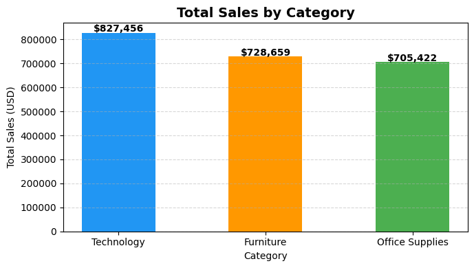
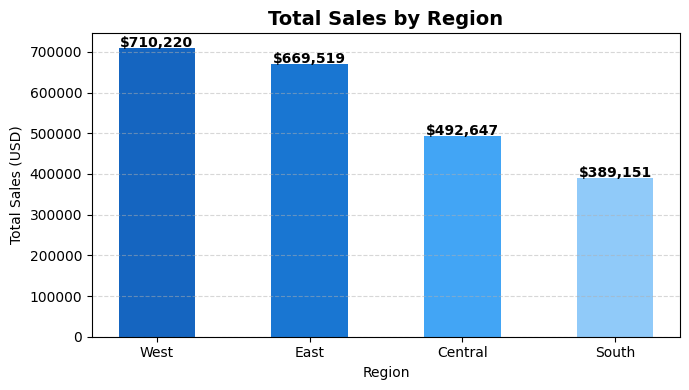
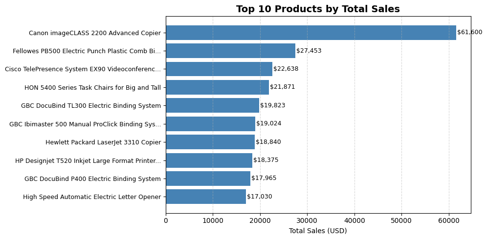
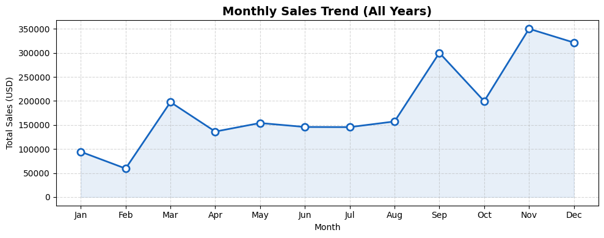

# 📊 Sales Data Analysis Project

> مشروع تحليلي شامل لمبيعات المتجر (Superstore Sales Dataset) باستخدام لغة Python ومكتبات تحليل البيانات لاستخراج رؤى استراتيجية تدعم اتخاذ القرار التجاري.

---

## 🎯 نظرة عامة على المشروع (Project Overview)
يهدف هذا المشروع إلى تحليل بيانات مبيعات متجر تجاري لتقييم الأداء العام، ومعرفة الفئات الأكثر ربحية، وتحديد الأنماط الموسمية للمبيعات، وتقديم توصيات مبنية على البيانات لتحسين الاستراتيجيات التسويقية والتشغيلية.

---

## 🛠️ الأدوات والمكتبات المستخدمة
تم بناء هذا المشروع وتطويره باستخدام الأداوت التالية:
* **Python** (للبرمجة ومعالجة البيانات)
* **Pandas & NumPy** (لتنظيف، تنظيم، وتحليل البيانات الإحصائية)
* **Matplotlib** (لتوليد الرسوم البيانية والتصريحات البصرية)
* **Jupyter Notebook** (بيئة التطوير التفاعلية)

---

## 📂 هيكل المشروع (Project Structure)
```text
├── sales_analysis.ipynb    # ملف النوت بوك الرئيسي ويحتوي على الكود بالكامل
├── train.csv               # ملف البيانات الخام (Dataset)
├── chart1_category.png     # رسم بياني: إجمالي المبيعات حسب الفئة
├── chart2_region.png       # رسم بياني: إجمالي المبيعات حسب المنطقة الجغرافية
├── chart3_products.png     # رسم بياني: أفضل 10 منتجات مبيعاً
├── chart4_monthly.png      # رسم بياني: اتجاه المبيعات الشهري
└── README.md               # ملف التوثيق الشامل للمشروع
```

---

## 📈 ملخص النتائج والتحليلات البصرية

إليك استعراض لأهم الرسوم البيانية المستخرجة من التحليل:

### 1. إجمالي المبيعات حسب الفئة (Total Sales by Category)
* تتصدر فئة **Technology** قائمة الفئات الأكثر دخلاً وإيراداً.
<p align="center">
  
</p>

### 2. المبيعات حسب المنطقة الجغرافية (Total Sales by Region)
* تسجل منطقة **West** أعلى حجم مبيعات، بينما تأتي منطقة **South** في المرتبة الأخيرة.
<p align="center">
  
</p>

### 3. أفضل 10 منتجات من حيث المبيعات (Top 10 Products by Total Sales)
* يتصدر جهاز **Canon imageCLASS 2200 Advanced Copier** قائمة المنتجات الأكثر مبيعاً بفارق ملحوظ عن باقي المنتجات.
<p align="center">
  
</p>

### 4. اتجاه المبيعات الشهري (Monthly Sales Trend)
* تظهر قفزات ضخمة في المبيعات خلال شهري **نوفمبر وديسمبر**، مما يعكس الأثر الإيجابي لموسم العطلات ونهاية العام (Q4).
<p align="center">
  
</p>

---

## 💡 أبرز الرؤى التجارية (Key Business Insights)
1. **التركيز على قطاع التكنولوجيا:** يمثل قطاع التكنولوجيا المحرك الأساسي للأرباح والإيرادات الكلية.
2. **الموسمية الواضحة:** ترتفع المبيعات بشكل ملحوظ في الربع الأخير من العام، وهو ما يتطلب خطط مخزون وحملات تسويقية مبكرة.
3. **التفاوت الجغرافي:** المبيعات في الغرب والشرق أقوى بكثير من الوسط والجنوب، مما يستدعي استراتيجيات مخصصة لدعم المناطق الأقل مبيعاً.

---

## 🚀 كيفية تشغيل المشروع محلياً
1. تثبيت المكتبات المطلوبة:
   ```bash
   pip install pandas numpy matplotlib
   ```
2. افتح ملف `sales_analysis.ipynb` عبر Jupyter Notebook واستمتع باستعراض التحليلات والأكواد البرمجية.